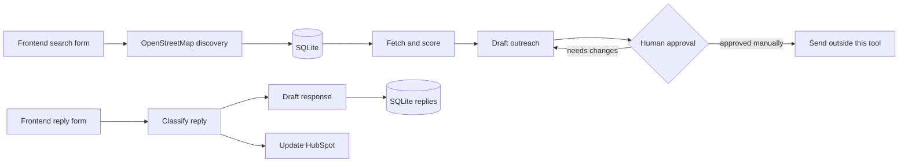

# Mini Outbound Engine

A small, review-first outbound workflow for ScaleBuild AI's ideal customers:
source companies, score fit, draft grounded outreach, classify replies, and update HubSpot.

Nothing sends automatically. Outreach and reply drafts are written with `status=needs_approval`.

## Quick start

Install [uv](https://docs.astral.sh/uv/), then run the web app:

```powershell
uv run app/main.py
```

Open `http://127.0.0.1:8000`.

The frontend discovers companies, scores leads, creates drafts, and processes replies. The durable application state is stored in SQLite at `data/outbound.db`.

Set `OPENROUTER_MODEL` to override the default model. Set `SENDER_NAME` to add a signature. Set `HUBSPOT_API_KEY` only when you are ready to update CRM records, then omit `--dry-run`.

## Frontend inputs

The dashboard accepts:

- company type, such as software, clinic, agency, or logistics
- location, such as Raleigh, NC or London, UK
- optional search keywords
- result limit, from 1 to 100
- inbound reply text, with optional contact and HubSpot deal details

Company discovery uses OpenStreetMap Nominatim and Overpass. These services require no API key. Results are stored directly in SQLite; there is no CSV upload step.

## Local dashboard

SQLite is the source of truth for the local UI. The database is created at `data/outbound.db` and is intentionally ignored by Git.

Start the dashboard with:

```powershell
uv run app/main.py
```

Open `http://127.0.0.1:8000`. Search for companies from the dashboard, score the discovered leads, generate outreach drafts, and paste inbound replies for classification. Approve/reject controls change review state only; this project never sends email.

## Workflow



## Guardrails

- `NO_HOOK` is used when no explicit job post, news, or context evidence is supplied.
- The model is instructed not to invent facts, metrics, people, or triggers.

## Verification

```powershell
uv run engine.py
uv run --with requests --with beautifulsoup4 --with fastapi --with uvicorn --with jinja2 --with python-multipart python -m unittest test_engine.py
```

The dashboard uses FastAPI, Uvicorn, Jinja2, and `python-multipart`; `uv run app/main.py` resolves those inline dependencies automatically.

## How the flow works

### 1. Discover and score leads

The dashboard sends company type, location, keywords, and result limit to `app.discovery`. Nominatim resolves the location and Overpass searches nearby OpenStreetMap businesses. Each result is stored in SQLite immediately.

The Score new leads action fetches reachable websites, sends the text and `icp.md` to OpenRouter, normalizes the `SCORE:` and `REASON:` response, and updates the lead in SQLite. Website text is scoring evidence only; outreach hooks require explicit verified context.

### 2. Personalize, then wait for approval

The Create drafts action processes scored leads above the selected threshold. It calls `engine.build_draft_prompt()` to construct a constrained prompt and `engine.llm()` to generate a first line and short email.

When verified context exists, the model may use it for the hook. When it does not, the prompt contains a literal `NO_HOOK` fallback that discloses there is no specific trigger. The result is parsed by `engine.parse_draft()` and persisted in SQLite with `status=needs_approval`.

There is no send function. A person reviews the dashboard, edits or approves the draft, and sends it through their normal email process.

### 3. Classify replies and update CRM

The reply form accepts an inbound message. `engine.classify()` handles unsubscribe and out-of-office phrases locally, then sends ambiguous replies to OpenRouter. Unknown model output falls back to `not_now` so a reply is held rather than dropped.

`engine.draft_reply()` uses fixed safe responses for unsubscribe and out-of-office messages and the reply model for the other labels. HubSpot updates are opt-in through the checkbox; otherwise the result is a dry run. The response, label, CRM result, and `status=needs_approval` are persisted in SQLite for dashboard review.

## What is used

- **Python 3.11+:** web application, discovery, prompt construction, and tests.
- **uv:** runs each script with its inline dependency metadata without a committed virtual environment.
- **Requests:** fetches company pages and calls OpenRouter and HubSpot over HTTPS.
- **BeautifulSoup:** removes scripts and presentation markup, then extracts readable website text.
- **OpenRouter:** provides the scoring, outreach-drafting, and ambiguous-reply classification model. `OPENROUTER_MODEL` selects the model.
- **SQLite:** stores leads, drafts, replies, statuses, and pipeline state for the dashboard.
- **OpenStreetMap Nominatim:** resolves the location entered in the frontend.
- **OpenStreetMap Overpass:** discovers nearby businesses without an API key.
- **HubSpot API:** optionally upserts contacts and updates deals in the reply stage.
- **Mermaid:** documents the pipeline in this README; it is not a runtime dependency.

## File and method guide

### `engine.py` — shared components

- `fetch(url)`: downloads a site with a browser-like user agent, timeout, redirect handling, HTML cleanup, and a 6,000-character limit.
- `llm(system, user, max_tokens)`: sends a request to OpenRouter, retries rate-limit/server failures, and returns the model text. It requires `OPENROUTER_API_KEY`.
- `parse_score(text)`: extracts and clamps a numeric score and one-line reason from model output.
- `build_score_prompt(icp, name, url, text)`: creates the scoring request and skips the model when no site text exists.
- `verified_context(row)` in `score.py`: selects only explicit context, job-post, or news fields for personalization.
- `build_draft_prompt(name, url, reason, context)`: creates either a grounded hook prompt or the `NO_HOOK` fallback.
- `parse_draft(text)`: separates the generated first line from the email body.
- `classify(text, ask)`: applies deterministic unsubscribe/out-of-office rules before using the model.
- `draft_reply(label, text, name, ask)`: returns a fixed safe template or asks the model for a reply draft.
- `crm_update(email, name, label, deal_id)`: updates HubSpot contact lifecycle and, when supplied, the deal stage.
- `demo()`: runs lightweight assertions without requiring an API key.

### Dashboard components

- `app/main.py`: FastAPI application, discovery/scoring/drafting/reply routes, and approval-state endpoints.
- `app/db.py`: SQLite schema, connections, lead upserts, draft/reply persistence, counts, and status updates.
- `app/discovery.py`: free OpenStreetMap geocoding and nearby company discovery.
- `app/workflows.py`: browser-triggered scoring, draft generation, reply processing, and `NO_HOOK` context selection.
- `templates/base.html`: shared page shell and stylesheet link.
- `templates/dashboard.html`: summary cards, lead ranking, draft review, and recent replies.
- `templates/lead.html`: lead score, reason, verified context, and scraped text detail.
- `static/app.css`: responsive dashboard styling.

### Configuration and data

- `icp.md`: the human-readable ideal-customer profile supplied to the scoring model.
- `test_engine.py`: regression tests for hook safety and deterministic reply paths.
- `data/outbound.db`: local SQLite database created at runtime; ignored by Git.
- `.gitignore`: keeps API secrets, Python caches, and generated outputs out of version control.
