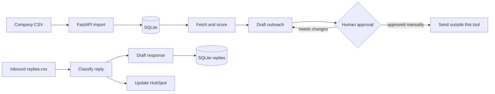

# Mini Outbound Engine

A small, review-first outbound workflow for ScaleBuild AI's ideal customers:
source companies, score fit, draft grounded outreach, classify replies, and update HubSpot.

Nothing sends automatically. Outreach and reply drafts are written with `status=needs_approval`.

## Quick start

Install [uv](https://docs.astral.sh/uv/), then run:

```powershell
$env:OPENROUTER_API_KEY = "sk-or-v1-..."
uv run score.py --input companies.csv --limit 6
uv run draft.py --min-score 60
uv run replies.py --dry-run
```

The outputs are `leads.csv`, `drafts.csv`, and `replies_out.csv`. Import any CSV into Google Sheets for review.

Set `OPENROUTER_MODEL` to override the default model. Set `SENDER_NAME` to add a signature. Set `HUBSPOT_API_KEY` only when you are ready to update CRM records, then omit `--dry-run`.

## Input files

`companies.csv` requires `name` and `website`; `contact_email` is optional. Optional `context`, `job_post`, and `news` columns provide verified personalization evidence. Website text is used for scoring only and does not count as an outreach hook by itself.

`replies.csv` requires `reply_text`; `email`, `name`, and `deal_id` are optional. Reply labels are `interested`, `not_now`, `wrong_person`, `unsubscribe`, and `out_of_office`.

## Local dashboard

SQLite is now the source of truth for the local UI. The database is created at `data/outbound.db` and is intentionally ignored by Git. CSV import is explicit; starting the app does not silently migrate files.

Start the dashboard with:

```powershell
uv run app/main.py
```

Open `http://127.0.0.1:8000`. Import `companies.csv` from the dashboard, then use the CLI jobs to score leads, generate drafts, and classify replies. Refresh the dashboard to review persisted results. Approve/reject controls change review state only; this project never sends email.

## Workflow



## Guardrails

- `NO_HOOK` is used when no explicit job post, news, or context evidence is supplied.
- The model is instructed not to invent facts, metrics, people, or triggers.

## Verification

```powershell
uv run engine.py
uv run python -m unittest test_engine.py
````

See `handoff.md` for the current implementation status and the short Loom walkthrough outline.

## How the flow works

### 1. Source and score leads

`companies.csv` is the input queue. `score.py` reads each company, skips names already present in `leads.csv`, and calls `engine.fetch()` to retrieve readable website text. The page text is sent to OpenRouter with the ICP from `icp.md`; the model must return a `SCORE:` and `REASON:` pair.

The result is normalized by `engine.parse_score()`, stored with the company data, sorted from highest to lowest score, and written to `leads.csv`. Website text is used as scoring evidence only. A lead gets outreach context only when the input row explicitly includes `context`, `job_post`, or `news`.

### 2. Personalize, then wait for approval

`draft.py` reads `leads.csv` and processes leads at or above `--min-score`. It calls `engine.build_draft_prompt()` to construct a constrained prompt and `engine.llm()` to generate a first line and short email.

When verified context exists, the model may use it for the hook. When it does not, the prompt contains a literal `NO_HOOK` fallback that discloses there is no specific trigger. The result is parsed by `engine.parse_draft()`, optionally gets the `SENDER_NAME` signature, and is appended to `drafts.csv` with `status=needs_approval`.

There is no send function. A person reviews the CSV, edits or approves the draft, and sends it through their normal email process.

### 3. Classify replies and update CRM

`replies.py` reads inbound messages from `replies.csv`. `engine.classify()` handles unsubscribe and out-of-office phrases locally, then sends ambiguous replies to OpenRouter. Unknown model output falls back to `not_now` so a reply is held rather than dropped.

`engine.draft_reply()` uses fixed safe responses for unsubscribe and out-of-office messages and the reply model for the other labels. Unless `--dry-run` is used, `engine.crm_update()` upserts the contact in HubSpot and patches the supplied deal stage. The final response, label, CRM result, and `status=needs_approval` are written to `replies_out.csv`.

## What is used

- **Python 3.11+:** scripts, CSV processing, prompt construction, and tests.
- **uv:** runs each script with its inline dependency metadata without a committed virtual environment.
- **Requests:** fetches company pages and calls OpenRouter and HubSpot over HTTPS.
- **BeautifulSoup:** removes scripts and presentation markup, then extracts readable website text.
- **OpenRouter:** provides the scoring, outreach-drafting, and ambiguous-reply classification model. `OPENROUTER_MODEL` selects the model.
- **CSV files:** act as the simple local data store and can be imported directly into Google Sheets.
- **HubSpot API:** optionally upserts contacts and updates deals in the reply stage.
- **Mermaid:** documents the pipeline in this README; it is not a runtime dependency.

## File and method guide

### `engine.py` — shared components

- `fetch(url)`: downloads a site with a browser-like user agent, timeout, redirect handling, HTML cleanup, and a 6,000-character limit.
- `llm(system, user, max_tokens)`: sends a request to OpenRouter, retries rate-limit/server failures, and returns the model text. It requires `OPENROUTER_API_KEY`.
- `parse_score(text)`: extracts and clamps a numeric score and one-line reason from model output.
- `build_score_prompt(icp, name, url, text)`: creates the scoring request and skips the model when no site text exists.
- `verified_context(row)` in `score.py`: selects only explicit context, job-post, or news fields for personalization.
- `build_draft_prompt(name, url, reason, context)`: creates either a grounded hook prompt or the `NO_HOOK` fallback.
- `parse_draft(text)`: separates the generated first line from the email body.
- `classify(text, ask)`: applies deterministic unsubscribe/out-of-office rules before using the model.
- `draft_reply(label, text, name, ask)`: returns a fixed safe template or asks the model for a reply draft.
- `crm_update(email, name, label, deal_id)`: updates HubSpot contact lifecycle and, when supplied, the deal stage.
- `demo()`: runs lightweight assertions without requiring an API key.

### Stage scripts

- `score.py`: stage 1 orchestration, input reading, resume behavior, rate pacing, ranking, and `leads.csv` output.
- `draft.py`: stage 2 orchestration, score threshold filtering, duplicate prevention, signatures, and approval-state output.
- `replies.py`: stage 3 orchestration, input validation, dry-run behavior, classification, CRM updates, and response output.

### Configuration and data

- `icp.md`: the human-readable ideal-customer profile supplied to the scoring model.
- `companies.csv`: company source list; replace the six-row sample with an Apollo, Google Maps, or job-board export.
- `replies.csv`: sample inbound replies and optional HubSpot deal IDs.
- `test_engine.py`: regression tests for hook safety and deterministic reply paths.
- `handoff.md`: implementation status, design decisions, risks, and coordination notes for other agents.
- `.gitignore`: keeps API secrets, Python caches, and generated outputs out of version control.
